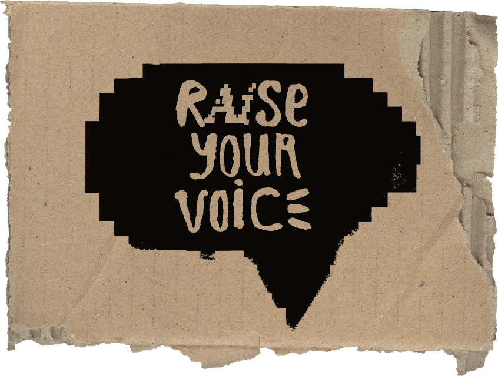
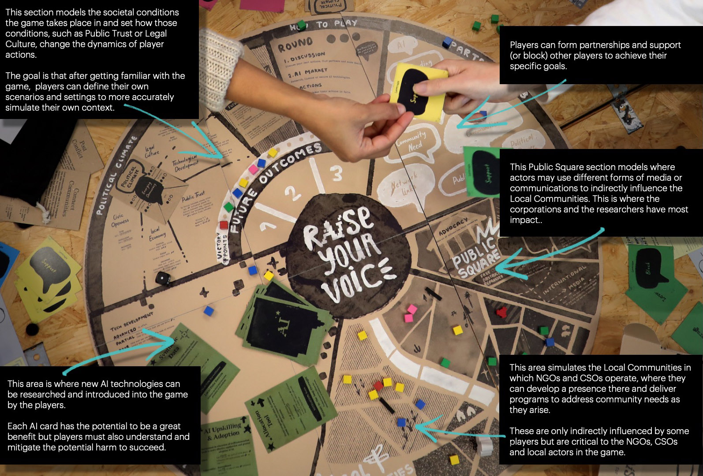
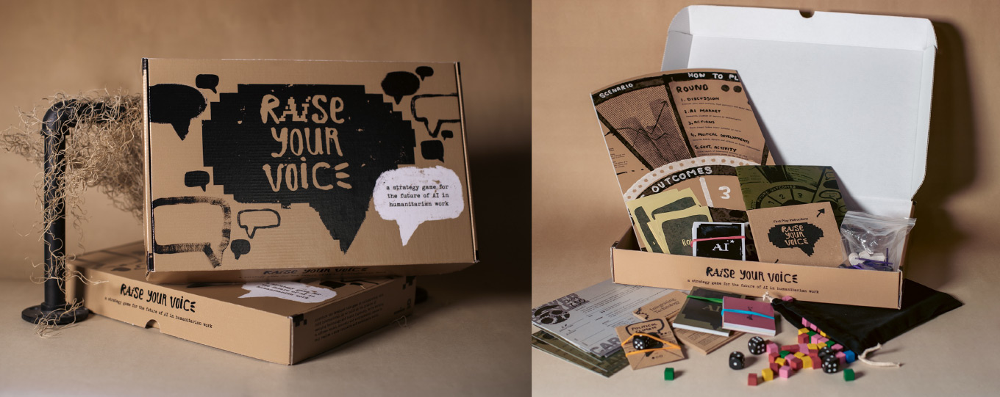

# 💬 Raise Your Voice 📢
> A strategy game for the future of AI in humanitarian work by Accenture

**5 PLAYERS | ~120 MINUTES (First Play mode) / 180 MINUTES (Full Play mode)**

*Raise Your Voice* is a strategic tabletop game exploring how AI impacts communities, governance, and organizational strategies — especially for those traditionally underserved or excluded from decision-making.

This game is already in use by **Accenture** and **partner organizations worldwide** and we’re excited to make it publicly available soon. Whether you're a policymaker, civil society leader, researcher, technologist, or educator, *Raise Your Voice* is designed to help you think systemically, collaboratively, and critically about artificial intelligence.

🌍 **Join us as we empower more people and organizations to shape an inclusive AI future.**

---

## 📢 What is *Raise Your Voice*?

We are living through one of the most profound transformations in human history: the rise and rapid spread of artificial intelligence. From disaster response to education and public infrastructure, AI is reshaping our world — but **who gets to decide how these technologies are developed, deployed, and governed?**

Right now, many of those decisions are made far from the communities that feel AI’s greatest impact. *Raise Your Voice* equips players — from community organizers to global strategists — to wrestle with these issues and game out the future.

### Inspired by Evidence-Based Research
*Raise Your Voice* is inspired by **Accenture** and **CARE International’s** work on [*AI and the Global South*](https://careint.uk/AI-GlobalSouth-Report). That research identified a key gap: the people most affected by AI are often the least involved in shaping it.

This game is one response — a **creative tool to provoke insight, discussion, and action**.

---

## 🎲 How the Game Works

Players take on asymmetric roles like:
- **Civil Society Organizations (CSOs)**
- **Non-Governmental Organizations (NGOs)**
- **Multinational Corporations (MNCs)**
- **Researchers**
- **Local Actors** (e.g. workers, small businesses, informal networks — even criminals!)

Over **three rounds**, players:
- Navigate shifting **political climates**
- Debate and build alliances in the **Public Square**
- Deploy or resist **AI technologies**
- Influence **Local Communities**
- Face moral and strategic dilemmas around AI’s deployment

The gameplay is grounded in:
- **Participatory design**
- **Intentional asymmetry** (some players have power, others need allies)
- **Tough trade-offs**: Do you prioritize solving immediate community needs over influencing future policy?

---

## 💡 Why Play?

*Raise Your Voice* is designed for:
- 📚 **Education** — Researchers, universities, think tanks, schools of public policy or tech ethics
- 🏛️ **Strategy** — Civil society organizations, NGOs, governments, global organizations exploring AI impact
- 🤝 **Co-creation** — Community engagement and participatory design
- ⚖️ **Equity** — Anyone working to close the digital divide or center marginalized voices in tech policy

The game blends analytical rigor with creative play, helping leaders not just think *about* the future, but *think* in the future – exploring uncertainty, negotiating trade-offs, and responding to changing conditions to surface blind spots, stress-test assumptions, and uncover novel solutions.

---

## 📦 Coming Soon: Download & Play

We’re working to publish a **full print-and-play version** of the game, including:
- ℹ️ Rulebooks for **Full Play** and **First Play** modes
- 🗺️ Printable game board
- 🃏 Cards and tokens
- 📘 Scenarios and role materials

> *First Play Mode* is a simplified version, recommended for learning the game or shorter sessions.  
> *Full Play Mode* includes customizable political climates; multiple game scenarios; more actor types; enhanced AI licensing and harm mitigation capabilities; and introduces government interference and more.

---

## 🚀 Stay in the Loop

We’re excited to share this with **anyone grappling with how to harness Gen AI to close the digital divide in inclusive, participatory ways.**

**⭐ Star or 👁️ Watch this repository** to be notified when we release:
- Full rulebooks
- Print-and-play files
- Facilitators’ guide 
- Workshop/classroom tips

*Raise Your Voice is the product of collaborative design, strategic foresight, and global research. If you’re ready to play a part in designing a fairer AI future — this is your invitation.*

---

## 👥 Contributors
*Raise Your Voice* was designed by the Human Sciences Studio of Accenture at The Dock in Dublin.

**Game Design**: Shane Casey, Dr David Banks, PhD. 
**Visual Design & Game Materials**: Ciara Wade, Shane Casey, Peter Crawley 
**Research Team**: Dr Sabrina Anjara, PhD., Fergus Gleeson, Darragh Miller, Charlotte O'Neill, Lamiita Traista, Amy Dunford-Stenger, John Carruthers, Suzy Madigan, Jess Majekodunmi, Louise James, Jess Hyde, Suzanne Hickey  

---

## 🪪 License
 *Raise Your Voice* will be released under a <a rel="license" href="http://creativecommons.org/licenses/by-nc-sa/4.0/">**Creative Commons BY-NC-SA 4.0 License**</a> – free to use, remix, and adapt for non-commercial use with attribution.

*Raise Your Voice is the product of collaborative design, strategic foresight, and global research. If you’re ready to play a part in designing a fairer AI future — this is your invitation.*
