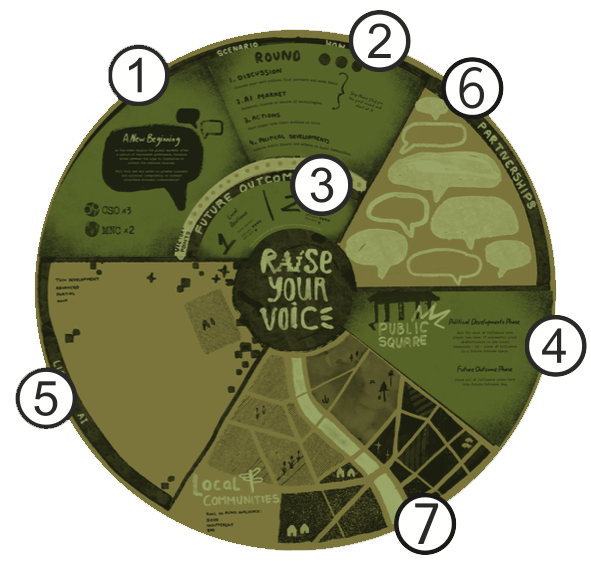

# 📢 Raise Your Voice
## 📔 First Play Rulebook

### *Raise Your Voice* is a strategy game created to help people understand and anticipate the impact of AI on communities in the Global South. 

Designed to reflect the world of grassroots community organizations and the experience of societies in flux, it gives participants insights into political contests and collaborations against a range of political circumstances. Players take on diverse roles — from local actors and NGOs to multinational corporations and researchers — navigating complex political and technological landscapes.

> ℹ️ **Tip**: **Bolded** terms refer to important in-game terms. They are explained below and can also be looked up in the glossary.

Each game of Raise Your Voice takes place over three rounds, during which players may achieve their specific **goals**. At the end of the last turn, the **Future Outcomes** of the society are determined before final scoring takes place.

The game is designed with two considerations in mind: the first is to represent its subject matter well enough to produce meaningful insights for participants; and the second is to be as playable as possible for anyone unfamiliar with such strategy games.

This game incorporates a variety of relevant factors – including background political structures, different strategic circumstances, alternative configurations of **actors**, **AI development** and **licensing**, **government intervention** and **local politics**.

The game can also be modified by its players to model situations not included in the game, by adding further **Political Climates** and **Scenarios** (see “Designing your own Scenarios” in the [Full Play rulebook](./full-play/README.md)).

As for playability, while we strongly recommend that at least one person learns the game beforehand to act as **facilitator** (see ‘Playing your first game’ at the end of this rule book), many of the game systems run automatically, allowing the players to focus instead on the actions they will take each turn. By about midway through their first game, players should be comfortable with how it plays and the types of decisions they should take.

Inspired by [Accenture and CARE International research](https://www.careinternational.org.uk/news-stories/ai-and-the-global-south-making-ai-more-ethical-and-effective-through-inclusive-participation/), the game reflects real-world dynamics in regions experiencing rapid change and unequal power. It is already in use by facilitators and organisations around the world.

We hope that you and your organization can use this game for education, strategic planning, analysis and cohort building. Even serious games should be fun.

 

## 🏆 Winning The Game

The winner of a game of *Raise Your Voice* is ultimately decided by the highest score, but there are two ways to score points – achieving short term goals and influencing the future outcome in line with your long term goals. The game takes place over just a few short rounds, so players must decide how to focus their efforts to greatest effect.

> ℹ️ **Tip**: Many of the game systems require that dice are rolled to determine the result. While the number of dice that are rolled by vary, they always work the same way. The number of dice to roll is indicated with 🎲 emojis on all materials.
 Any roll of a ‘6’ is a success, meaning the outcome occurs in a way that helps players. Any roll of a ‘1’ is a failure and may have negative effects for players. 

 

## 🔰 First Play Mode

These ‘First Play’ rules let new players quickly jump into a game of *Raise Your Voice* without needing to understand every element of the complete game. 

Instead, we strip the game down to its essentials so players can learn the core gameplay of *Raise Your Voice*. Once people have played this version once or twice, we strongly recommend that players read the full rulebook and play the complete game.

> ### ➡️ [Go to Full Play mode rulebook](./full-play/README.md)

 

## 🐣 Playing Your First Game

Many people are unfamiliar with complex board games and can find them daunting. Here are some suggestions to make it easier for players as they familiarize themselves with the game:

- **Someone acts as facilitator.** Rather than opening the box and trying to play the game with everyone present for the first time, one individual should offer to be the facilitator of the game. This person should read the rules of *RYV* ahead of the game or even play a ‘solo’ round or two to internalize the rules. This individual can then instruct people on game day. Further, this person can direct all ‘automatic’ in-game activity.
- **Situate the players.** Be sure to read out the scenario text fully then ask each player to read out their actor and role descriptions. This helps players understand the game in a more immersive way.
- **Begin with how to win.** Explain to each player how they score points. This only happens in two ways – achieving individually assigned goals to gain points, or by influencing Future Outcomes in their favor. If players are in doubt about what to do, working to acquire points is a good strategy.
- **Introduce rules phase by phase rather than all at once.** Encourage players to use the Partnerships space. They should place their own marker there to indicate what they need from other players, and watch to see whether they might be able to help another player.
- **Embrace ambiguity.** Strategic games like *Raise Your Voice* are designed to mirror real-world complexity — where not all information is available, and outcomes are influenced by other people’s choices. Encourage players to act with incomplete information, follow their instincts, and adapt their plans as the game unfolds. Uncertainty is part of the experience — and part of the learning. Insight often comes not from knowing everything in advance, but from navigating complexity together.
- **Remind players that you can play the game more than once.** Even experienced gamers make rules and strategy mistakes when playing a game for the first time. Don’t worry too much and enjoy it. You can always play again!

 

---
# 🎲 Getting Ready to Play

## 🧩 Board Description

The game board records nearly all player activity, houses the AI tech and keeps record of the turns rounds and score. Take the ‘First Play’ overlays and place them on the relevant parts of the board. As you can see, these overlays remove or simplify a number of game features.

> ℹ️ **Tip**: These overlays should cover the
following areas:
 ① Scenario and Political Climate
 ② How to Play
 ③ Future Outcomes
 ④ Public Square

### ③ Future Outcomes
These spaces represent the two potential long term outcomes of the scenario. If the 📢 Influence tokens placed in either of the two future spaces, the game ends.

### ④ Public Square
This represents the areas where actors communicate with the public and government to influence public opinion.
📢 Influence placed here indirectly affects Local Communities and directly affects Future Outcomes.

> ℹ️ **Tip**: In game terms, MNCs do very well in the Public Square, which indicates that money and material power have more immediate impact in shaping this environment.

### ⑤ Licensed AI
Any AI that is **licensed** is placed in this area with the player’s 📢 Influence token placed on it.

### ⑥ Partnerships
This space is used by players to signal the issue most important to them. By placing their 📢 Influence cubes in this space, players signal their openness to potential collaborations in the discussion phase of each round.

### ⑦ Local Communities
These four spaces represent the four different Local Communities (LC) in the society. During the game, players will take **actions** that may allow them to place 📢 **Influence** within them or resolve **Community Needs**. 

> 💡 **Hint**:  During the game, **CSOs** will find it easier to place 📢 Influence in Local Communities than **MNCs** who struggle to directly affect these spaces without assistance.

### Other Spaces
The remaining spaces on the board are used to record the current game turn round and score. Where possible, instructions for the gameplay are integrated into the board so keep an eye on the details written on each section.

 

## ♟️ Components

To play *Raise Your Voice* First Play mode you'll need the following components.

### Boards
❏ 1 x **Game Board** - see print instructions  
❏ 3 x **Game Board overlays** - see print instructions  
❏ 5 x **First Play Actor mats**: 3 x CSO, 2 x MNC - see print instructions 

### Cards
❏ 12 x **First Play AI tech cards** - see print instructions  
❏ 20 x **Leverage cards** - see print instructions  

### Pieces
❏ 6 x 🎲 **dice** - 6 is ideal, but 1 can be rerolled as necessary  
❏ 100 x 📢 **Influence cubes** (20 x 5 different colors) - these denote player influence on spaces/cards so either [pre-made cubes like these](https://www.thegamecrafter.com/parts/cube-10mm-blue) or any differentiated tokens you can find could work e.g. Lego pieces, painted pebbles, small coins, game pieces from other games, candy, etc.  
❏ 8 x Community Need tokens
❏ 40 x ⚡️ **Power Point discs** - as above, these could be any small coin or token you have to hand or [something like this](https://www.thegamecrafter.com/parts/disc-15mm-x-5mm-black)  
❏ 1 x **Future Outcomes bag** - a small opaque bag

 

## 📋 Set-Up

Set up a game of *Raise Your Voice* - First Play as follows:

1. Ensure all **board overlays** are placed on the **board**. These will sometimes have text that supersedes that of the printed board.
2. Shuffle the **AI tech cards**. If you are playing with less than 5 players, remove 2 AI cards from the deck for each player missing.
3. Distribute the First Play **CSO and MNC actor mats** to players.
4. Each player should choose a color and gather the supply of 📢 **Influence cubes** matching this and place them nearby.  They should also take their **Leverage** cards matching this color.
5. Each player should place one of their cubes on the corner of their mat to indicate their player color.
> ❗️ **Note:**  if playing with less than 5 players, always have more CSOs than MNCs in the game.
6. Each player should collect **Power Points** (⚡️) equal to the amount listed on their player mat plus one additional ⚡️ to start.
7. Each player receives one random First Play **AI tech card**.
8. Place player 📢 Influence Tokens on the board as follows:
    1. For each **MNC player**, place one 📢 Influence in the **Public Square**.
    2. For each **CSO player**, place a **Community Need** in a random Local Community. **Note:** Do not place in the same Local Community.
9. Choose a player at random to take the first player token. They go first, and play continues to their left.

****You are ready to begin! 🚀****

 

# 🔄 Sequence of Play

Each game of *Raise Your Voice* takes place over three **rounds** (and a half). Each round has four **phases**. Each phase must be taken in order and completed in its entirety unless otherwise directed. 

For the first round, players should skip **Phase 1** and **2** and start with the **Action Phase**. This helps players get to grips with their role's goals and capabilities before introducing the **Leverage** and **AI tech** game dynamics.  At the end of the third round, **Future Outcomes** are determined. Players then calculate their total final scores to decide the winner.

> ℹ️ **Tip**: While four phases per round might seem daunting, the game is designed so that some of these phases run ‘automatically,’ and do not require more from players than a careful following of instructions. The player with most previous game experience should run these phases. Also note that the full game has an additional **Government Activity** phase, which is
not present in the *First Play* version.

> 💡 **Hint**: Recommended times for each phase are noted below. Some players will want to deliberate over decisions and examine every potential consequence but part of the power of games is that, as in real-life, decisions must sometimes be made with incomplete information or certainty.  

## ⓵ Discussion Phase
*⏱️ ~5 Minutes*

In this phase, players can formally enter into agreements or discuss how they might work together in *Raise Your Voice*. Players can agree to almost anything but may not break the rules or directly exchange any ⚡️. However, both CSO and MNC players can aid or hinder one another by using their **Leverage** abilities. CSOs may **Support** or **Block** MNCs in **Local Communities**. By contrast, MNCs may **Support** or **Block** CSOs effort to affect the **Public Square**. Consult the *First Play* actor mats for more details.

> ❗️ **Note:** Players may only use these Leverage abilities once each per round.

Players are not obliged to use either ability unless they wish to. The recipient of the ability must be determined before the next phase begins. Players may not refuse to accept a Leverage ability that is targeted at them.

## ② AI Market Phase
*⏱️ ~5 Minutes*

In this phase players have an opportunity to take AI-related actions. AI tech that is researched by players may be placed into the **Licensed AI** Space. When this is done, this AI may now be used by the player who licensed it.

In addition, this player may agree to license this AI tech to other players, who must pay at least 1 ⚡️ to the owning player for the privilege. AI offers both opportunities and vulnerabilities.

While AI Tech may assist players in meeting some goals, they leave their users open to potential exploitation or harm. However, these potential vulnerabilities can be mitigated against. Every AI card also comes with a **Mitigation** printed on it.

If a player licenses an AI that mitigates the vulnerability on another of their AI tech, then they can ignore the effects of that vulnerability.

> 💡 **Hint**:  Players may notice that there are three kinds of vulnerability in **First Play**. However, they can only be secured by gaining access to a different AI card. This means the only way a player can completely prevent an AI vulnerability from occurring is to gain access to all three AI **mitigations**.

In this phase, beginning with the first player, each player takes an **AI action**. Continue until all players have taken all of their AI actions.

Different players are entitled to take a different number of free AI actions, as follows:
- **CSOs**: Two AI actions
- **MNCs**: Three AI actions

The individual AI actions are as follows:
- **Research AI** — Draw two cards from the AI deck and discard one. Players may immediately take the ‘**License AI**’ action if they like.
- **License AI** — Pay 1 ⚡️ and place an **AI tech card** into the **Licensed AI** space. Place an 📢 Influence token on this card. Alternatively, pay at
least 1 ⚡️ to a player who owns this AI Tech. Place additional 📢 Influence
on this card to indicate shared use.

> 💡 **Hint**: Note that the license owner may charge any amount to another player or even refuse to consider any offer. However, they must charge at least 1 ⚡️.

Play in this phase continues until all players have used all their allowed **AI actions**. At any time, a player may choose to pass on their turn. However, once they have passed, they may not take any more **AI actions** later in this phase.

> ℹ️ **Tip**: Some AI cards take immediate effect while others enhance or impede abilities in other Phases. Pay attention to the effects as described on the card.

## ③ Action Phase
*⏱️ ~15 Minutes*

The action phase is the heart of the game and where players will focus much of their attention. In this phase, beginning with the first player, each player takes three actions. Once all players have taken their actions, the phase is completed.

Actions are selected from player’s mats and their role cards, meaning each player will have five distinct actions to choose from. Each action comes with a **requirement** and an **effect**. Provided players have the requirement, an action can be selected. Many actions depend on a **successful** dice roll. Read the details carefully.

> ℹ️ **Tip**: Many of the actions and decisions in the game depend on rolling a dice – and sometimes more than one – to determine their outcomes. The more dice you are asked to roll, the more likely you are to succeed. The number of dice required is marked with 🎲 emoji on all materials. If any of them show a **six**, it counts as a **success**. Some actions require a roll to determine a **failure**, which is any dice coming up **one**.

Actions usually involve:
- Placing 📢 Influence in either Local Communities or the Public Square
- Gaining additional ⚡️
- Potentially meeting immediate goals
- Influencing Future Outcomes

> 💡 **Hint**: Each **actor** type has distinct strengths and weaknesses. Identifying these is key to player success as doing so helps indicate with whom they should collaborate.

## ④ Political Developments Phase
*⏱️ ~5 Minutes*

### Stage 1: Resolve the Public Square
For every 📢 Influence a player has in the **Public Square** roll 🎲🎲.
If successful, place 📢 Influence in one LC *or* a Future Outcome space.

### Stage 2: Local Community Activity
- Roll 🎲🎲🎲. For each *failure*, place one **Community Need** in a random LC if no Community Need already exists.
- If no LCs have a Community Need, place one in a random LC. 
- Roll 🎲🎲🎲🎲. If any failure rolled, an existing Community Need grows (add another Community Need token).

### Stage 3: Clean up
- Collect ⚡️ based on in-turn activity.
- Move First Player token to the left.
- At end of final round, resolve the **Future Outcomes** phase before final
scoring.

### 🔮 Future Outcomes Phase
*(end of round 3 only)*

At the end of the third round, conduct the Future Outcomes phase as follows:

- First, MNC players may remove 📢 Influence from the Public Square.
For every two 📢 📢 Influence removed, an MNC player may reduce
their **Negative Reputation** by 1.
- Next, gather all remaining player 📢 Influence in the Public Square and place in the Future Outcomes bag.
- For each Local Community with <ins>no</ins> Community Need, place 📢 Influence tokens for CSOs only in the Future Outcomes bag. 
- Now draw out 📢 Influence tokens from the bag one at a time. When each token comes out the owning player can decide which Future Outcomes space to place it in.
- Continue drawing tokens until either:
    - A single Future Outcomes space holds **five tokens**, or
    - There are no tokens remaining in the bag.
- Once either condition is fulfilled, stop drawing tokens and prepare for final scoring.

 

## 🏁 Deciding the Outcome

Players win *RYV* by meeting in-game goals as well as shaping Future Outcomes. The final score for each player is determined as follows:

1. For MNC players only, remove a 🏆 point for each Negative Reputation remaining. 
2. Check Future Outcome space with most combined influence.

If there is more MNC influence than CSO influence, then MNC gains 4 and CSO gains 1. If there is more CSO than MNC, then the opposite happens. If 📢 Influence of only one type of player is present in the area (e.g. just MNC), then only that player type gains 🏆 Victory Points.

**The player with the highest score of 🏆 Victory Points wins.** 

In the event of a tie, the CSO players win. If CSO players are tied, then they share the victory.

 

## 💬 Debrief

Studies have shown that players are more likely to internalize the ‘right’ lessons and discard the ‘wrong’ ones from a game if they are given an opportunity to debrief after the experience. It is strongly recommended that a proper debrief takes place at the end of the game to gain the most from the experience. On average a debrief should be about 20% the duration of the entire game time.

Debriefs should have two sections. The first section allows players to relive and analyze the game as a narrative experience and give them an opportunity to re!ect on the quality of the play. Here you can ask questions such as:
- What was the narrative of this game?
- Why did the winners win?
- What was your best action?
- What was the key moment of the game?

The second section of the debrief gives the players an opportunity to ‘break’ the game; that is expose the strengths and limits of the model and to consider these trade-offs when they reflect on the lessons the game taught. Examples of questions for this section include:
- Which dynamics were realistic?
- How do you win in this game? Is this how ‘winning’ works in the real world?
- What was missing from this game? How would its inclusion change things?
- Were the right players and their abilities represented in the game?
- What relevant players were missing? How does their presence change real-world examples of political action?
- Is there a strategy one can take from this game? Do others agree?